# Whimzee

## Project Summary:

Our project is a user-friendly shop website that facilitates the buying and selling of new and pre-owned items. The platform offers a range of features to enhance the user experience, including user registration, login, and logout functionalities. Once logged in, users have the ability to create their own shop and manage their listings.
\
\
The key features of the website include:

- User Registration and Authentication: Users can sign up with their personal details and create an account. They can subsequently log in to access the full range of functionalities offered by the website. Logging out allows users to securely end their session.
- Shop Creation: Each registered user has the option to open their own shop. This feature enables users to showcase their products and manage their inventory in a personalized space.
- Listing Creation: Once a user has created a shop, they can create listings for the items they want to sell. Users can provide comprehensive details about the products, including images, descriptions, and pricing.
- Reviews and Ratings: Users have the ability to leave reviews for items they have purchased or interacted with. This feature enables an open and transparent feedback system, allowing users to make informed decisions when browsing listings.
- Landing Page: The landing page serves as a central hub for all the listings available on the website. Users can explore a wide range of items across different categories, allowing for easy browsing and discovery.
- Navigation Bar: The navigation bar offers convenient search functionalities. Users can search for specific items by selecting a category or using the search by name function. This feature streamlines the process of finding desired products within the website's extensive inventory.
   
  Overall, our shop website provides a user-friendly interface for buying and selling items. The combination of user management, shop creation, listing creation, reviews, and efficient search functionalities ensures a seamless experience for users as they explore and interact with the platform.
   
   

**Team**

- Christina Beckaskenaizer \
  Backend: Categories, Listings \
  Frontend: Listings, Wishlist \
  Unit test: \
  Backend Auth

- Sina Klughardt \
  Backend Endpoints: Users/Accounts, Orders \
  Frontend: Navbar(Searchbar, Navigation, Logos), Reviews, Landing Page \
  Unit Test: test_category(get and create) \
  Backend Auth

- Santiago Bothe \
  Backend: Accounts, Shops, Reviews, Cart listings \
  Frontend: Shops, Account Page, Payment, Specialized Operations \
  Unit Test: Test_shops, Test_users\
  Frontend Auth, Backend Deployment

- Preeti Mahar \
  Backend: Cart \
  Frontend: \
  Unit Test:

## How to run this project

Live link: https://whimz.gitlab.io/module3-project-gamma/ \
Here are step by step instructions to run this project:

1. clone this Repository to the local machine \
   Run the following commands in the project directory:
2. docker volume create postgres-data
3. docker-compose build
4. docker-compose up
   (If on mac, safely ignore the warning about an environment variable)
5. Check if all containers are running
6. In your browser go to http://localhost:3000/

## Project Diagram

Diagram of the backend and how every table interacts with each other

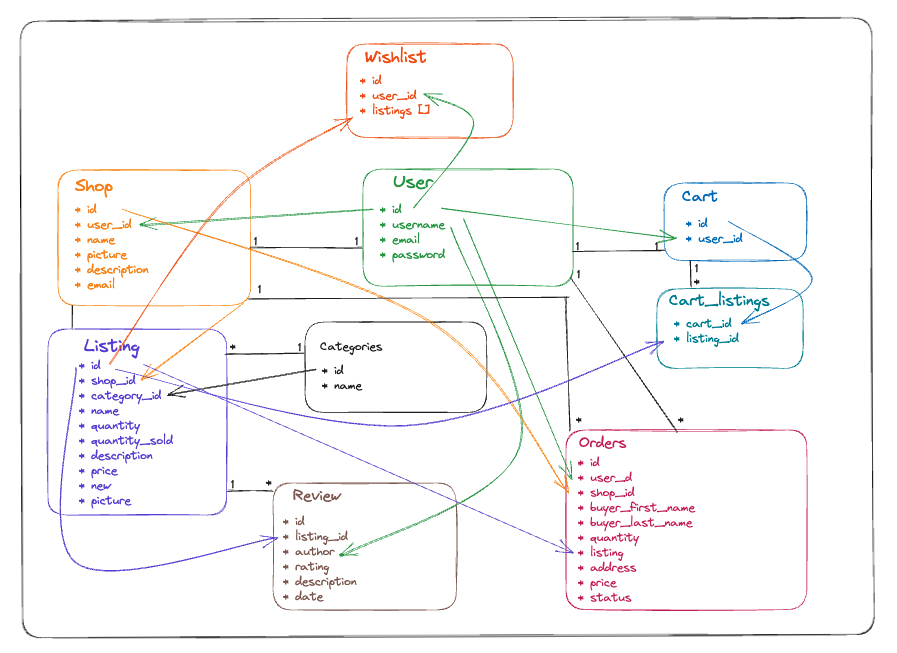

## API Documentation

### Token

**Endpoint: Get Token** \
Method: GET \
Request URL: http://localhost:8000/token \
Description: Get token in use \
What is necessary: no request body necessary, only Request URL

Response

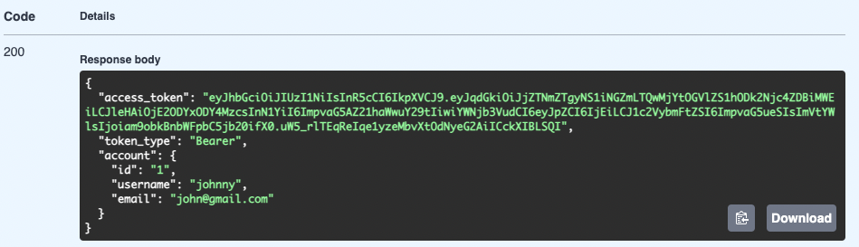

 

**Endpoint: Login** \
Method: POST \
Request URL: http://localhost:8000/token \
Description: Login to existing account \
What is necessary: request body with fields: "email" and "password"

Request body

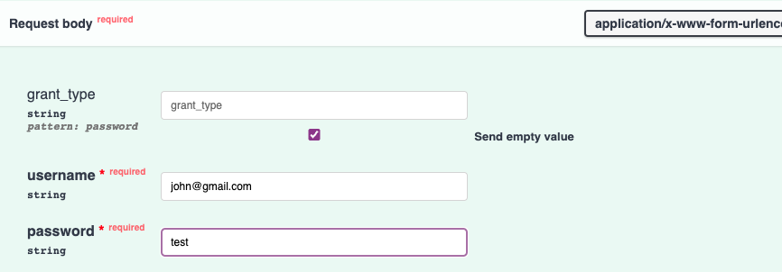

Response

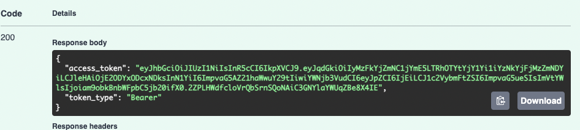

 

**Endpoint: Logout** \
Method: DELETE \
Request URL: http://localhost:8000/token \
Description: Delete a token and get logged out \
What is necessary: no request body only Request URL

Response

 

### User/Account

**Endpoint: Create Account** \
Method: POST \
Request URL: http://localhost:8000/api/accounts \
Description: Create a new account/user \
What is necessary: request body with fields: "username", "email" and "password"

Request body

Response

 

**Endpoint: Get Ids For User** \
Method: GET \
Request URL: http://localhost:8000/user/{user_id} \
Description: Get user_id, shop_id and cart_id for a user \
What is necessary: user_id in Request Url, no request body

Response

 

**Endpoint: Delete a user** \
Method: DELETE \
Request URL: http://localhost:8000/users/{user_id} \
Description: Delete a user and return true if user got deleted \
What is necessary: user_id in Request Url, no request body

Response

 

**Endpoint: Get a user** \
Method: GET \
Request URL: http://localhost:8000/users/{email} \
Description: See if a user exist necessary for frontend, true if user exists \
What is necessary: Email in Request Url, no request body

Response

 

### Shop

**Endpoint: Create Shop** \
Method: POST \
Request URL: http://localhost:8000/shops \
Authorization: Requires user Login and Token \
Description: Create a new shop \
What is necessary: request body with fields: "name", "profile_picture", "description" and "email"

Request body

Response

 

**Endpoint: Get Shops** \
Method: GET \
Request URL: http://localhost:8000/shops \
Description: Get all shops \

Response

 

**Endpoint: Get Shop** \
Method: POST \
Request URL: http://localhost:8000/shops/{shop_id} \
Description: Get a shop \
What is necessary: Url with correct "shop id".

Request body

 

**Endpoint: Update Shop** \
Method: PUT \
Request URL: http://localhost:8000/shops/{shop_id} \
Authorization: Requires user Login and Token \
Description: Update a shop \
What is necessary: Url with correct "shop id".

Request body

Response

 

**Endpoint: Delete Shop** \
Method: DELETE \
Request URL: http://localhost:8000/shops/{shop_id} \
Authorization: Requires user Login and Token \
Description: Delete a shop \
What is necessary: Url with correct "shop id".

Request body

 

### Listing

**Endpoint: Get all listings** \
Method: GET \
Request URL: http://localhost:8000/listings \
Description: Get all listings \
What is necessary: No Request body necessary, just the Request URL

Response

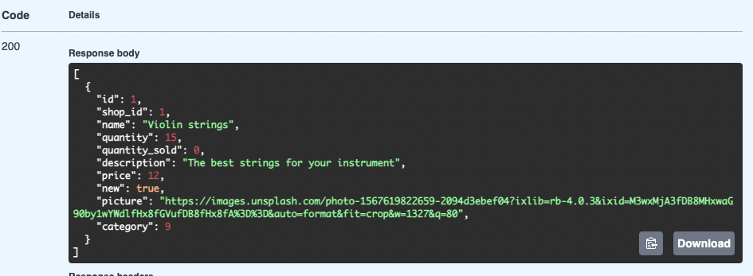

 

**Endpoint: Create a listing** \
Method: POST \
Request URL: http://localhost:8000/listings \
Description: Create a new listing \
What is necessary: request body with fields: "shop_id", "name", "quantity", "description", "price", "new", "picture" and "category"

Request body

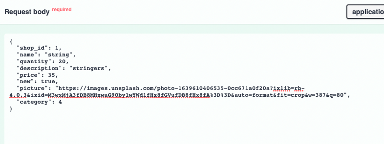

Response

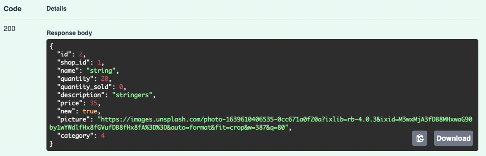

 

**Endpoint: Get one listing** \
Method: GET \
Request URL: http://localhost:8000/listings/{listing_id} \
Description: Get one listing by listing_id \
What is necessary: No Request body necessary, just the Url with listing_id

Response

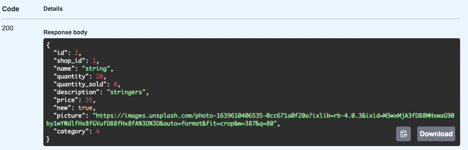

 

**Endpoint: Update Listing** \
Method: PUT \
Request URL: http://localhost:8000/listings/{listing_id} \
Description: Update any field in listing \
What is necessary: request body and Request URL

Request body

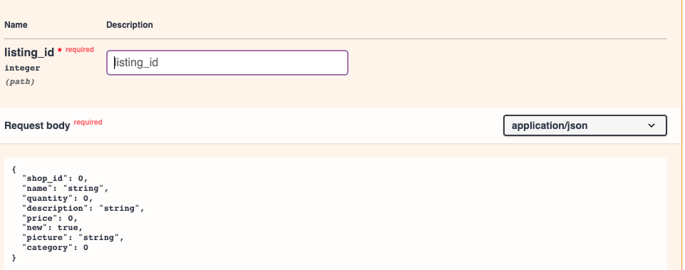

Response

 

**Endpoint: Delete a listing** \
Method: DELETE \
Request URL: http://localhost:8000/listings/{listing_id} \
Description: Delete a listing and return true if listing got deleted \
What is necessary: listing_id in Request Url, no request body

Response

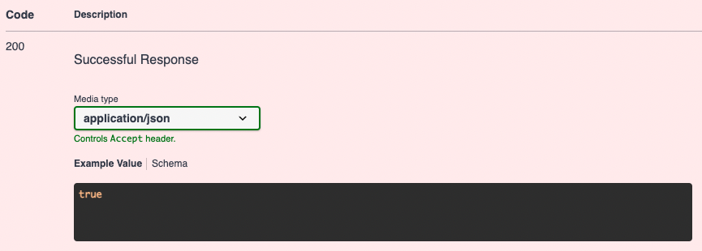

 

**Endpoint: Update Inventory** \
Method: PUT \
Request URL: http://localhost:8000/{listing_id}/inventory \
Description: Update quantity and quantity sold on a listing \
What is necessary: request body with fields: "quantity" and "quantity_sold" and Request URL with listing_id

Request body

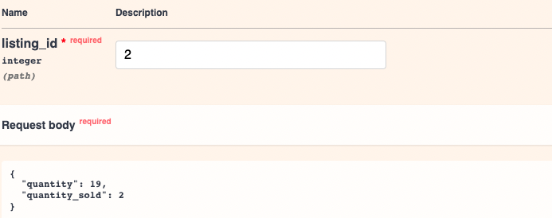

Response

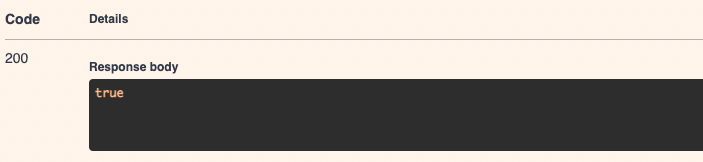

 

### Cart

### Order

**Endpoint: Get all user orders** \
Method: GET \
Request URL: http://localhost:8000/orders \
Description: Get all orders of the currently logged in user \
What is necessary: No Request body, just the Url

Response

 

**Endpoint: Create an order** \
Method: POST \
Request URL: http://localhost:8000/orders \
Description: Create a new order \
What is necessary: request body with fields: "shop_id", "buyer_first_name", "buyer_last_name", "quantity", "listing", "address", "price"

Request body

Response

 

**Endpoint: Get all shop orders** \
Method: GET \
Request URL: http://localhost:8000/{shop_id}/orders \
Description: Get all orders of a shop \
What is necessary: No Request body necessary, just the Url with shop_id

Response

 

**Endpoint: Get one order** \
Method: GET \
Request URL: http://localhost:8000/orders/{order_id} \
Description: Get one orders by order_id \
What is necessary: No Request body necessary, just the Url with order_id

Response

 

**Endpoint: Update Order** \
Method: PUT \
Request URL: http://localhost:8000/orders/{order_id} \
Description: Update status of order to true when order got processed \
What is necessary: request body with field: "status" and Request URL

Request body

Response

 

### Reviews

**Endpoint: Create Review** \
Method: POST \
Request URL: http://localhost:8000/{listing_id}/reviews \
Authorization: Requires user Login and Token \
Description: Create a new review for a listing \
What is necessary: request body with fields: "rating" and "description".

Request body

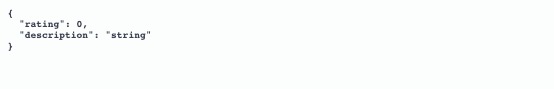

Response

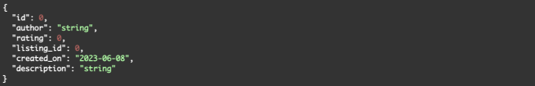

 

**Endpoint: Get Reviews** \
Method: GET \
Request URL: http://localhost:8000/{listing_id}/reviews \
Description: Get all reviews for a listing \
What is necessary: Url with correct "listing id"

Response

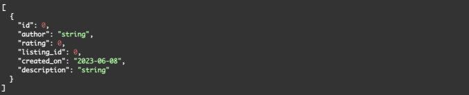

 

**Endpoint: Delete Review** \
Method: DELETE \
Request URL: http://localhost:8000/reviews/{review_id} \
Authorization: Requires user Login and Token \
Description: Delete a review \
What is necessary: Url with correct "review id"

Response

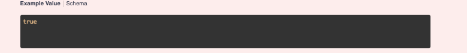

 

**Endpoint: Update Reviews** \
Method: PUT \
Request URL: http://localhost:8000/reviews/{review_id} \
Authorization: Requires user Login and Token \
Description: Update review for a listing \
What is necessary: request body with fields: "rating" and "description".

Request body

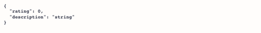

Response

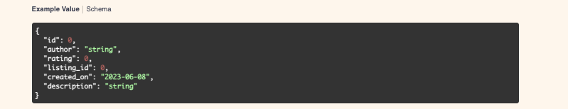

 

### Categories

### Cart Listings

**Endpoint: Create Cart Listing** \
Method: POST \
Request URL: http://localhost:8000/cart_listings \
Description: Create a new cart listing \
What is necessary: request body with fields: "cart_id" and "listing_id".

Request body

**Endpoint: Get all categories** \
Method: GET \
Request URL: http://localhost:8000/categories \
Description: Get all existing categories \
What is necessary: No request body, just Request Url

Response

 

**Endpoint: Create category** \
Method: POST \
Request URL: http://localhost:8000/categories \
Description: Create a new category \
What is necessary: Request Body with a "name" field and Request Url

Request body

Response

 

**Endpoint: Delete Cart Listing** \
Method: DELETE \
Request URL: http://localhost:8000/cart_listings/{cart_listing_id} \
Description: Delete a cart listing \
What is necessary: Url with correct "cart listing id".

Response

 

**Endpoint: Get Cart Listing** \
Method: GET \
Request URL: http://localhost:8000/cart_listings/{cart_id} \
Description: Get all cart listings for a cart \
What is necessary: Url with correct "cart id".

Response

 

